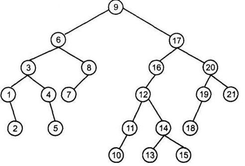

.. sphinx-lr7-progr documentation master file, created by
   sphinx-quickstart on Wed Jun  4 07:48:22 2025.
   You can adapt this file completely to your liking, but it should at least
   contain the root `toctree` directive.

**Бинарное дерево**
===========================================

.. toctree::
   :maxdepth: 2
   :caption: Contents:

Бинарное дерево (двоичное дерево) — это дерево, в котором у каждого из его узлов не более двух дочерних узлов.

Некоторые элементы бинарного дерева:

*   **Корневой узел (корень)** — первый узел дерева, он не имеет родителя, при этом все остальные узлы являются его потомками.
*   **Узел** — основная часть дерева, каждый из них содержит данные (значение) и имеет связь с потомками.
*   **Листовой узел** — это узел, у которого нет потомков: его правое и левое поддерево равно null.
*   **Родительский узел** — это узел, имеющий потомков, а дочерний — который сам является потомком.
*   **Путь** — это последовательность узлов, начиная от корня до заданного узла (в бинарном дереве может быть только один путь от корня до определённого элемента).
*   **Сиблинги** — это элементы, которые имеют общего родителя.
*   **Глубина узла** — это количество рёбер от корня до заданного узла (глубина корня равна 0).
*   **Высота дерева** — это максимальное количество узлов от корня до листового узла.

Алгоритм построения бинарного дерева
-------------------------------------

Этот алгоритм описывает общую логику построения бинарного дерева.

1.  **Определите структуру узла (Node):**

    *   Создайте класс или структуру, представляющую узел дерева.
    *   Узел должен содержать:

        *   ``data``: Поле для хранения данных (значение узла).
        *   ``left``: Указатель (ссылку) на левого потомка.
        *   ``right``: Указатель (ссылку) на правого потомка.

2.  **Определите корень дерева:**

    *   Выберите (или создайте) узел, который будет корнем дерева. Данные для этого узла должны быть взяты из вашего набора данных.
    *   Установите указатели ``left`` и ``right`` корня в NULL, если он пока не имеет потомков.

3.  **Определите метод (алгоритм) вставки узлов:**

    *   Выберите метод, который будете использовать для вставки новых узлов в дерево. Этот метод зависит от типа бинарного дерева, который вы хотите построить:

        *   **Для произвольного бинарного дерева:** Просто добавляйте узлы слева направо, заполняя уровни дерева.
        *   **Для бинарного дерева поиска (BST):** Вставляйте узлы в соответствии со значениями их данных, чтобы дерево оставалось отсортированным (левое поддерево < узел < правое поддерево).
        *   **Для сбалансированных деревьев (AVL, Red-Black):** Используйте специальные алгоритмы вставки, которые поддерживают баланс дерева после каждой вставки.

4.  **Вставка узлов (итеративно или рекурсивно):**

    *   Повторяйте следующие шаги для каждого элемента данных, который вы хотите добавить в дерево:

        a.  **Создайте новый узел:**

            *   Создайте новый экземпляр класса узла.
            *   Присвойте полю ``data`` нового узла значение текущего элемента данных.
            *   Установите указатели ``left`` и ``right`` нового узла в NULL (или None).

        b.  **Найдите место для вставки:**

            *   Начиная с корня дерева, следуйте выбранному алгоритму вставки (см. шаг 3), чтобы найти место, где нужно вставить новый узел.
            *   Это может включать сравнение данных нового узла с данными существующих узлов и перемещение влево или вправо по дереву, пока не будет найдено подходящее место.

        c.  **Вставьте новый узел:**

            *   Когда место для вставки найдено, вставьте новый узел:

                *   Если место для вставки слева: установите ``left`` родительского узла на новый узел.
                *   Если место для вставки справа: установите ``right`` родительского узла на новый узел.

5.  **(Для сбалансированных деревьев) Поддерживайте баланс:**

    *   Если вы строите сбалансированное дерево (например, AVL или Red-Black), после каждой вставки выполняйте операции балансировки (например, вращения), чтобы поддерживать баланс дерева.

Математические формулы
----------------------------------

* **Формула 1: Максимальное количество узлов в бинарном дереве высоты h**

:math:`2^{h+1}-1`

* **Формула 2: Минимальное количество узлов в бинарном дереве высоты h**

:math:`h+1`

* **Формула 3: Связь между листьями (L) и узлами со степенью 2 (I) в дереве, где каждый узел имеет либо 0, либо 2 потомка**

:math:`L = I+1`

Пример кода на Python:
--------------------------

.. code-block:: python

import random

class Node:
    def __init__(self, data):
        self.data = data
        self.left = None
        self.right = None

def create_tree(height):
    if height < 0:
        return None
    else:
        new_node = Node(random.randint(1, 100))
        new_node.left = create_tree(height - 1)
        new_node.right = create_tree(height - 1)
        return new_node

def count_nodes(root):
    if root is None:
        return 0
    else:
        return 1 + count_nodes(root.left) + count_nodes(root.right)

def tree_height(root):
    if root is None:
        return -1
    else:
        left_height = tree_height(root.left)
        right_height = tree_height(root.right)
        return 1 + max(left_height, right_height)

def count_leaves(root):
    if root is None:
        return 0
    if root.left is None and root.right is None:
        return 1
    else:
        return count_leaves(root.left) + count_leaves(root.right)
if __name__ == '__main__':
    root = create_tree(3)

    num_nodes = count_nodes(root)
    print(f"Количество узлов в дереве: {num_nodes}")

    height = tree_height(root)
    print(f"Высота дерева: {height}")

    leaves = count_leaves(root)
    print(f"Количество листьев: {leaves}")
